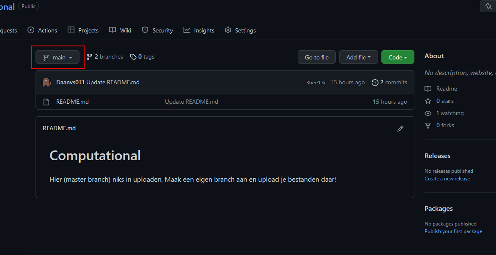
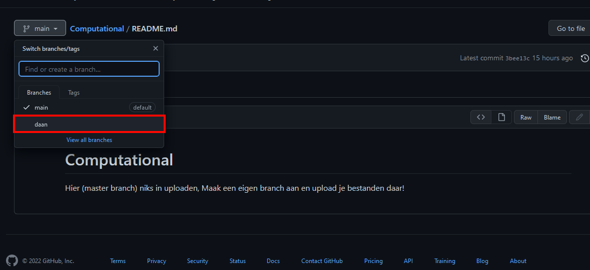
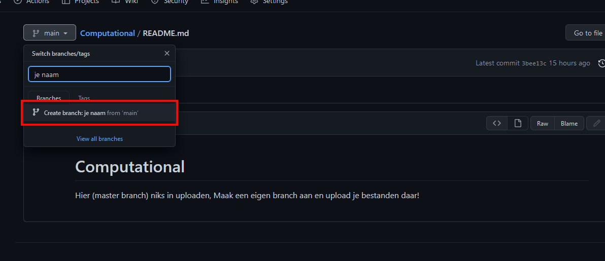

# Computational

Hier (master branch) niks in uploaden,
Maak een eigen branch aan en upload je bestanden daar!

# Hoe verander ik de branch?
Klik op de met rood aangeduide knop

Klik op de branch die je wilt selecteren

Wil je een nieuwe branch aanmaken, vul dan je naam in

